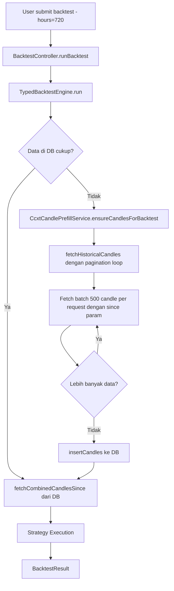

# Plan: Fetch Historical Candles untuk Backtest 1 Bulan

## Latar Belakang

Sistem backtest saat ini mengambil candle dari SQLite database lokal. Jika bot baru berjalan atau pair baru ditambahkan, data historis tidak tersedia. `CcxtCandlePrefillService` hanya mengambil 500 candle terakhir tanpa dukungan parameter `since`, sehingga backtest lebih dari ~500 candle tidak bisa dilakukan dari exchange secara otomatis.

**Tujuan:** Backtest 1 bulan (720 jam) harus bisa berjalan meskipun data belum ada di database, dengan cara fetch otomatis dari exchange menggunakan pagination.

---

## Arsitektur Solusi



---

## Perubahan yang Diperlukan

### 1. `src/modules/system/ccxt_candle_prefill_service.ts`

Tambah dua method baru:

#### `fetchHistoricalCandles(exchange, symbol, period, since, until)` — private
- Loop pagination: fetch 500 candle per request menggunakan parameter `since` dari CCXT `fetchOHLCV`
- Setiap batch, update `since` ke timestamp candle terakhir yang diterima
- Berhenti jika candle yang dikembalikan < 500 (sudah habis) atau sudah melewati `until`
- Return semua candle yang terkumpul sebagai `ExchangeCandlestick[]`

```typescript
// Pseudocode
private async fetchHistoricalCandles(
  exchange: string,
  symbol: string,
  period: string,
  since: number,  // unix timestamp in seconds
  until: number   // unix timestamp in seconds
): Promise<ExchangeCandlestick[]> {
  const allCandles: ExchangeCandlestick[] = [];
  let currentSince = since * 1000; // CCXT uses milliseconds

  while (true) {
    const ohlcv = await ccxtExchange.fetchOHLCV(symbol, period, currentSince, CANDLES_LIMIT);
    if (ohlcv.length === 0) break;

    const batch = ohlcv
      .filter(c => Math.floor(c[0] / 1000) <= until)
      .map(c => new ExchangeCandlestick(...));

    allCandles.push(...batch);

    if (ohlcv.length < CANDLES_LIMIT) break; // no more data
    if (ohlcv[ohlcv.length - 1][0] / 1000 >= until) break; // reached end

    currentSince = ohlcv[ohlcv.length - 1][0] + 1; // next batch starts after last candle
  }

  return allCandles;
}
```

#### `ensureCandlesForBacktest(exchange, symbol, period, since, until)` — public
- Cek apakah DB sudah punya candle untuk rentang waktu yang diminta
- Jika tidak cukup, panggil `fetchHistoricalCandles()` dan simpan ke DB via `candleImporter.insertCandles()`
- Return jumlah candle yang di-fetch

```typescript
async ensureCandlesForBacktest(
  exchange: string,
  symbol: string,
  period: string,
  since: number,
  until: number
): Promise<number>
```

---

### 2. `src/modules/strategy/v2/typed_backtest.ts`

#### Modifikasi `BacktestConfigWithHours`
Tidak ada perubahan pada interface, tapi `TypedBacktestEngine` perlu menerima `CcxtCandlePrefillService` sebagai dependency opsional.

#### Modifikasi `TypedBacktestEngine` constructor
```typescript
export class TypedBacktestEngine {
  constructor(
    private exchangeCandleCombine: ExchangeCandleCombine,
    private executor: StrategyExecutor,
    private ccxtCandlePrefillService?: CcxtCandlePrefillService  // NEW - optional
  ) {}
```

#### Modifikasi `TypedBacktestEngine.run()`
Sebelum fetch dari DB, panggil `ensureCandlesForBacktest` jika service tersedia:

```typescript
async run(...): Promise<BacktestResult> {
  const { exchange, symbol, period, hours, initialCapital, useAi } = config;

  const endTime = Math.floor(Date.now() / 1000);
  const startTime = endTime - hours * 3600;
  const prefillTime = startTime - 200 * convertPeriodToMinute(period) * 60;

  // NEW: Ensure historical candles are available in DB
  if (this.ccxtCandlePrefillService) {
    await this.ccxtCandlePrefillService.ensureCandlesForBacktest(
      exchange, symbol, period, prefillTime, endTime
    );
  }

  // Existing: fetch from DB
  const candleData = await this.exchangeCandleCombine.fetchCombinedCandlesSince(...);
  ...
}
```

---

### 3. `src/modules/services.ts`

Update `BacktestController` instantiation untuk meneruskan `ccxtCandlePrefillService` ke `TypedBacktestEngine`:

```typescript
// Di dalam getBacktestController() atau di mana BacktestController dibuat
const engine = new TypedBacktestEngine(
  exchangeCandleCombine,
  strategyExecutor,
  ccxtCandlePrefillService  // NEW
);
```

Atau jika `TypedBacktestEngine` dibuat di dalam `BacktestController`, perlu update constructor `BacktestController` untuk menerima dan meneruskan `CcxtCandlePrefillService`.

---

### 4. `views/backtest.ejs`

Update field "Last Hours" dengan preset buttons dan label yang lebih jelas:

```html
<div>
  <label for="form-hours" class="block font-medium mb-1">Backtest Duration</label>
  <input class="w-full border border-gray-300 rounded px-3 py-2"
         id="form-hours" name="hours" value="168" required>
  <div class="flex gap-2 mt-2 flex-wrap">
    <button type="button" class="preset-btn text-xs px-2 py-1 border rounded" data-hours="24">1 Day</button>
    <button type="button" class="preset-btn text-xs px-2 py-1 border rounded" data-hours="168">7 Days</button>
    <button type="button" class="preset-btn text-xs px-2 py-1 border rounded" data-hours="720">30 Days</button>
    <button type="button" class="preset-btn text-xs px-2 py-1 border rounded" data-hours="2160">90 Days</button>
  </div>
  <p class="text-xs text-gray-500 mt-1">Hours from now (168 = 7 days, 720 = 30 days)</p>
</div>
```

Tambah JavaScript untuk preset buttons:
```javascript
document.querySelectorAll('.preset-btn').forEach(btn => {
  btn.addEventListener('click', function() {
    document.getElementById('form-hours').value = this.dataset.hours;
  });
});
```

---

### 5. `views/backtest_multi.ejs`

Sinkronkan perubahan UI yang sama seperti `backtest.ejs`.

---

## Urutan Implementasi

1. **`CcxtCandlePrefillService`** — tambah `fetchHistoricalCandles()` dan `ensureCandlesForBacktest()`
2. **`TypedBacktestEngine`** — update constructor dan method `run()` 
3. **`services.ts`** — inject dependency baru
4. **`views/backtest.ejs`** — update UI dengan preset buttons
5. **`views/backtest_multi.ejs`** — sinkronkan UI

---

## Pertimbangan Teknis

### Rate Limiting
Exchange memiliki rate limit. Untuk backtest 1 bulan dengan period `1m` (~43,200 candle), perlu ~87 request batch. Perlu tambah delay antar request atau gunakan rate limiter bawaan CCXT.

Solusi: Tambah `await new Promise(r => setTimeout(r, 200))` antar batch, atau gunakan `ccxtExchange.rateLimit` property.

### Candle yang Sudah Ada di DB
Sebelum fetch dari exchange, cek apakah candle untuk rentang waktu tersebut sudah ada di DB untuk menghindari duplikasi dan request yang tidak perlu.

Cara cek: Query `candlestickRepository.getLookbacksSince()` dan bandingkan jumlah candle yang ada vs yang diharapkan berdasarkan period dan rentang waktu.

### Exchange yang Tidak Support `since` Parameter
Beberapa exchange mungkin tidak mendukung parameter `since` di `fetchOHLCV`. Perlu handle error dan fallback ke fetch tanpa `since`.

### Batas Data Historis Exchange
Setiap exchange memiliki batas data historis yang berbeda (misalnya Binance menyimpan data hingga beberapa tahun, tapi exchange lain mungkin hanya beberapa bulan).

---

## File yang Dimodifikasi

| File | Jenis Perubahan |
|------|----------------|
| [`src/modules/system/ccxt_candle_prefill_service.ts`](src/modules/system/ccxt_candle_prefill_service.ts) | Tambah 2 method baru |
| [`src/modules/strategy/v2/typed_backtest.ts`](src/modules/strategy/v2/typed_backtest.ts) | Update constructor + `run()` method |
| [`src/modules/services.ts`](src/modules/services.ts) | Update dependency injection |
| [`views/backtest.ejs`](views/backtest.ejs) | Update UI dengan preset buttons |
| [`views/backtest_multi.ejs`](views/backtest_multi.ejs) | Sinkronkan UI |
